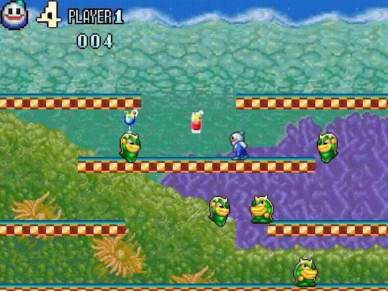
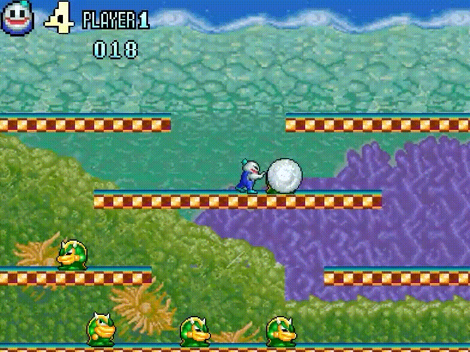
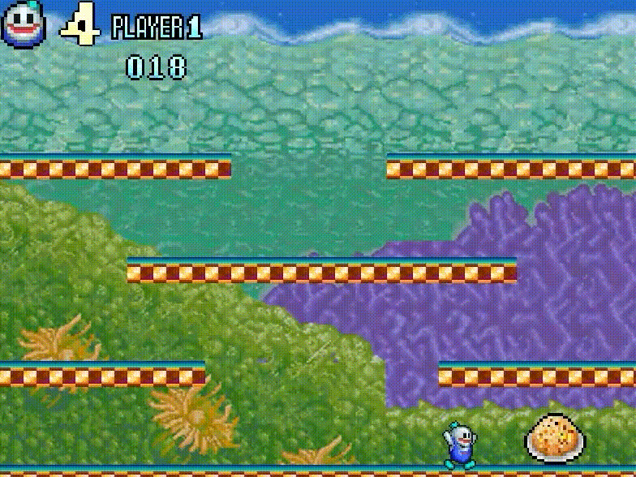
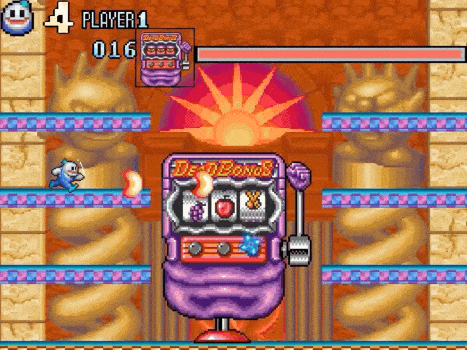

# SnowBrothers2 (Windows API 기반 게임 프로젝트)
## 시연 영상 [SnowBrothers2 시연 영상 재생](https://youtu.be/7BwQi_yRieA)

## ■ 개요
- Windows API를 활용한 2D 게임 모작 프로젝트
- 오락실 게임 '스노우브라더스2'를 모티브로 구현

## ■ 사용 기술
- C++ / Windows API
- Visual Studio 2022

## ■ 구현 내용
- 캐릭터 이동 및 점프

- 적 몬스터 AI 및 충돌 판정
- 몬스터 공격시, 눈 스택 변화
- 눈덩이와 몬스터 충돌 판정

- 씬 전환

- 보스 2개, 각각 패턴 2개씩

| 보스 1 | 보스 2 | 
| :---: | :---: | 
|  |   | 
---
